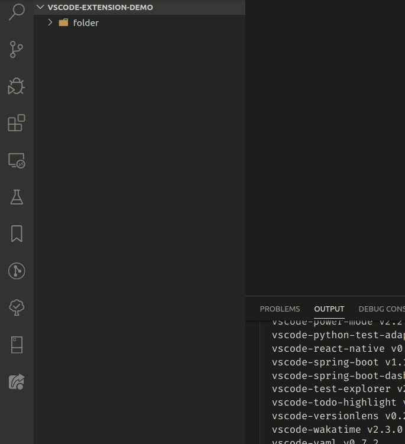

# Extract Folder | Visual Studio Code

## Features

- Extract the content of a file to the parent of the folder.

## Requirements

## Extension Settings

This extension contributes the following settings:

- `extractFolder.deleteFolderAfterExtraction`: weather to delete folder after extraction.

## Known Issues

## Release Notes

Users appreciate release notes as you update your extension.

### 1.0.0

Initial release of **Extract Folder**:

- **Extract Here** command.

---
